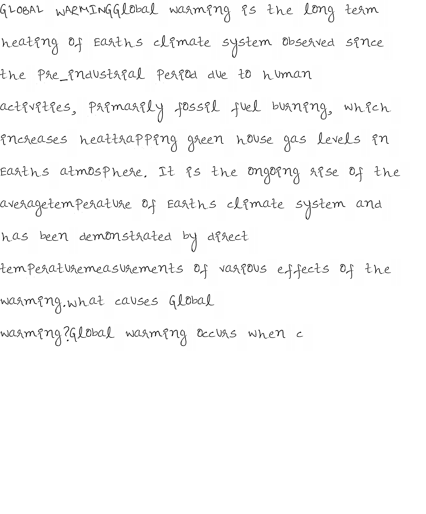
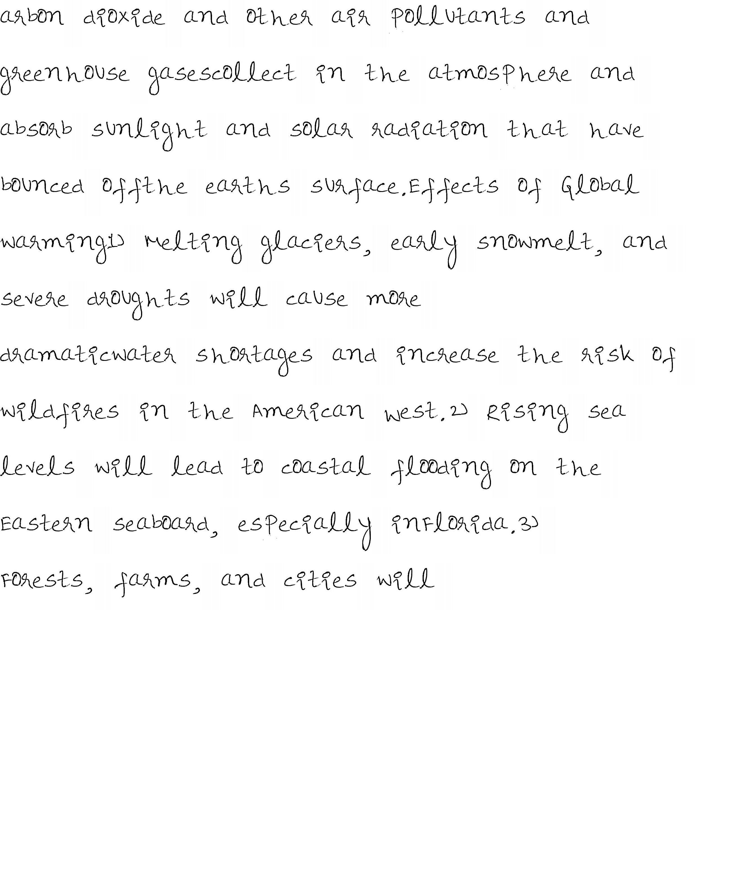

<p align="center">
	<h1 align="center"> Text to Handwriting converter </h1>
	<h4 align="center"> Convert text files into handwritten PDF <h4>
</p>
<br>

## Functionalities
- [X] Convert a text document (.txt file) into a PDF file with the text content handwritten

## Pre-requisites:
- [X] python 3.5 or 3.6
- [X] [Install Tesseract: an open source text recognition (OCR) Engine](https://github.com/tesseract-ocr/tessdoc/blob/master/Home.md)
- [X] dependencies from requirements.txt

```
 $ pip install -r requirements.txt
 ```

## Installing required python dependencies
- Clone this repository onto your system
```bash
$ git clone https://github.com/sharanya02/Text-file-to-handwritten-pdf-file
```
- Then, create a virtual environment and install the packages from requirements.txt.
```bash
$ python3 -m venv env
$ source env/bin/activate
$ pip install -r requirements.txt
```
## Directions to run
- Run the following command in the project directory:-
```
$ python txttohandwriting.py
```

## Demo

<p align="center">    </p>
